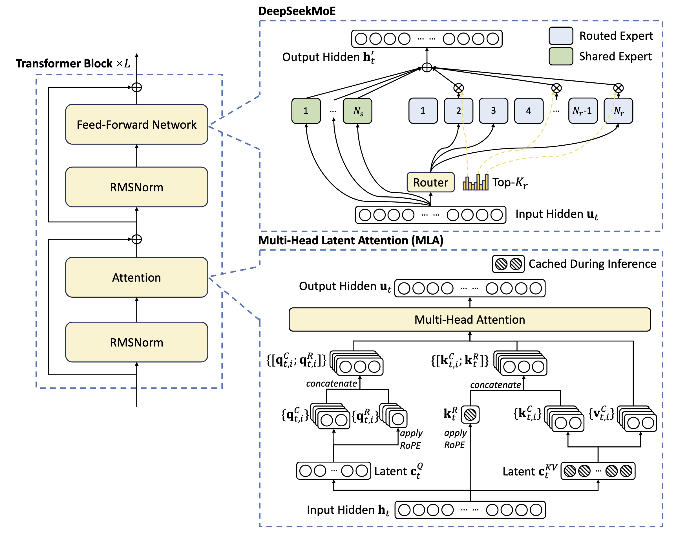

这份笔记聚焦于 **DeepSeek-V3** 的核心模型架构，其论文为[DeepSeek-V3 Technical Report](https://arxiv.org/abs/2412.19437)。DeepSeek-V3 沿用了 V2 的成功架构（MLA + DeepSeekMoE），并在 **负载均衡策略** 和 **训练目标** 上进行了重大创新。

以下是详细的技术笔记，包含严格复现的数学公式与符号解析。

---

# DeepSeek-V3 模型架构技术笔记

## 1. 概览 (Overview)
*   **基础架构**：Transformer
*   **总参数量**：671B
*   **激活参数量**：37B (per token)
*   **核心组件**：
    1.  **MLA (Multi-Head Latent Attention)**：高效推理，大幅减少 KV Cache。
    2.  **DeepSeekMoE**：细粒度专家 + 共享专家策略。
    3.  **无辅助损失负载均衡 (Auxiliary-Loss-Free Load Balancing)**：创新点，解耦路由与计算。
    4.  **多 Token 预测 (Multi-Token Prediction, MTP)**：新的训练目标。

结构图如下所示：

---

## 2. Multi-Head Latent Attention (MLA)
MLA 的核心在于对 KV 进行低秩联合压缩（Low-rank Joint Compression），并采用解耦的 RoPE 策略，在保持性能的同时显著降低推理显存占用。

### 符号定义
*   $d$: Embedding 维度
*   $n_h$: Attention 头数
*   $d_h$: 每个头的维度
*   $\mathbf{h}_t \in \mathbb{R}^d$: 第 $t$ 个 token 的 Attention 输入
*   $d_c (\ll d_h n_h)$: KV 压缩维度
*   $d_c' (\ll d_h n_h)$: Query 压缩维度
*   $d_h^R$: 携带 RoPE 的解耦维度

### KV 压缩与生成
MLA 不缓存完整的 Key 和 Value，而是缓存压缩后的潜变量 $\mathbf{c}_{KV}$ 和解耦的位置向量 $\mathbf{k}^R$。
$$
\begin{align}
\mathbf{c}_{t}^{KV} &= W^{DKV} \mathbf{h}_t \tag{1}, \\
[\mathbf{k}_{t,1}^C; \mathbf{k}_{t,2}^C; ...; \mathbf{k}_{t,n_h}^C] &= \mathbf{k}_t^C = W^{UK} \mathbf{c}_{t}^{KV} \tag{2}, \\
\mathbf{k}_t^R &= \mathrm{RoPE}(W^{KR} \mathbf{h}_t) \tag{3},\\
\mathbf{k}_{t,i} &= [\mathbf{k}_{t,i}^C; \mathbf{k}_t^R] \tag{4}, \\
[\mathbf{v}_{t,1}^C; \mathbf{v}_{t,2}^C; ...; \mathbf{v}_{t,n_h}^C] &= \mathbf{v}_t^C = W^{UV} \mathbf{c}_{t}^{KV} \tag{5}.
\end{align}
$$

*   **注**：推理时仅需缓存部分矩阵（$\mathbf{c}_{t}^{KV}$ 和 $\mathbf{k}_t^R$）。
*   $W^{DKV} \in \mathbb{R}^{d_c \times d}$: 降维投影矩阵
*   $W^{UK}, W^{UV} \in \mathbb{R}^{d_h n_h \times d_c}$: 升维投影矩阵

### Query 压缩与生成
对 Query 也进行了低秩压缩以减少训练时的激活显存（Activation Memory）。
$$
\begin{align}
\mathbf{c}_{t}^{Q} &= W^{DQ} \mathbf{h}_t \tag{6},\\
[\mathbf{q}_{t,1}^C; \mathbf{q}_{t,2}^C; ...; \mathbf{q}_{t,n_h}^C] = \mathbf{q}_t^C &= W^{UQ} \mathbf{c}_{t}^{Q} \tag{7}, \\
[\mathbf{q}_{t,1}^R; \mathbf{q}_{t,2}^R; ...; \mathbf{q}_{t,n_h}^R] &= \mathbf{q}_t^R = \mathrm{RoPE}(W^{QR} \mathbf{c}_{t}^{Q}) \tag{8}, \\
\mathbf{q}_{t,i} &= [\mathbf{q}_{t,i}^C; \mathbf{q}_{t,i}^R] \tag{9}.
\end{align}
$$
- **$\mathbf{c}_t^Q$**：压缩后的查询向量。
- **$d'_c$**：压缩后的维度，远小于原始维度。
- **$W^{DQ} / W^{UQ}$**：负责将查询维度先压缩再复原，以节省计算资源。
- **$W^{QR}$**：专门用于处理 RoPE（旋转位置编码）部分的矩阵，确保位置信息能正确嵌入。
### Attention 输出计算
最终，注意力查询 ($\mathbf{q}_{t,i}$)、键 ($\mathbf{k}_{j,i}$) 和值 ($\mathbf{v}_{j,i}^C$) 被组合在一起，生成最终的注意力输出 $\mathbf{u}_t$：
$$
\begin{align}
\mathbf{o}_{t,i} &= \sum_{j=1}^{t} \mathrm{Softmax}_j \Big( \frac{\mathbf{q}_{t,i}^T \mathbf{k}_{j,i}}{\sqrt{d_h + d_h^R}} \Big) \mathbf{v}_{j,i}^C \tag{10}, \\
\mathbf{u}_t &= W^O [\mathbf{o}_{t,1}; \mathbf{o}_{t,2}; ...; \mathbf{o}_{t,n_h}] \tag{11}.
\end{align}
$$
其中 $W^O \in \mathbb{R}^{d \times d_h n_h}$ 表示输出投影矩阵。

---

## 3. DeepSeekMoE 与 无辅助损失负载均衡
DeepSeek-V3 沿用了细粒度专家（Fine-grained Experts）和共享专家（Shared Experts）的设计，及DeepSeek-MoE架构（有论文），但创新性地引入了 **Auxiliary-Loss-Free** 策略来解决负载均衡问题，避免了传统辅助损失对模型性能的负面影响。

### 基础 DeepSeekMoE 架构
设 $\mathbf{u}_t$ 为第 $t$ 个 token 的 FFN 输入：

$$
\mathbf{h}'_t = \mathbf{u}_t + \sum_{i=1}^{N_s} \mathrm{FFN}_i^{(s)}(\mathbf{u}_t) + \sum_{i=1}^{N_r} g_{i,t} \mathrm{FFN}_i^{(r)}(\mathbf{u}_t) \tag{12}
$$

**Gate 值计算（归一化）**：
$$
g_{i,t} = \frac{s'_{i,t}}{\sum_{j=1}^{N_r} s'_{j,t}} \tag{13}
$$
**Top-K 选择逻辑**：
$$
s'_{i,t} = \begin{cases} s_{i,t}, & s_{i,t} \in \mathrm{Topk}(\{s_{j,t} | 1 \leqslant j \leqslant N_r\}, K_r), \\ 0, & \text{otherwise}, \end{cases} \tag{14}
$$
**亲和度分数 (Affinity Score)**：
$$
s_{i,t} = \mathrm{Sigmoid}(\mathbf{u}_t^T \mathbf{e}_i) \tag{15}
$$
*   $N_s, N_r$: 共享专家和路由专家数量。
*   $K_r$: 激活的路由专家数量。
*   $\mathbf{e}_i$: 第 $i$ 个专家的质心向量。

### 创新：无辅助损失负载均衡 (Auxiliary-Loss-Free Load Balancing)
为了在保证负载均衡的同时不干扰主模型的梯度更新，V3 引入了一个仅用于路由选择的 **Bias 项** $b_i$。

**修正后的 Top-K 路由逻辑**：
$$
g'_{i,t} = \begin{cases} s_{i,t}, & s_{i,t} + b_i \in \mathrm{Topk}(\{s_{j,t} + b_j | 1 \leqslant j \leqslant N_r\}, K_r), \\ 0, & \text{otherwise}. \end{cases} \tag{16}
$$

*   **关键点**：Bias $b_i$ 仅用于决定 **选哪个专家**（Eq. 16），但在计算最终输出时（Eq. 12, 13），使用的仍然是原始的亲和度分数 $s_{i,t}$。
*   **动态调整**：训练过程中监控专家负载，若过载则减小 $b_i$，若欠载则增加 $b_i$。

### 补充：序列级辅助损失 (Complementary Sequence-Wise Auxiliary Loss)
虽然主要依赖无损策略，但为了防止单序列内的极端不平衡，仍保留了一个极小权重的序列级平衡损失：
$$
\mathcal{L}_{\mathrm{Bal}} = \alpha \sum_{i=1}^{N_r} f_i P_i \tag{17}
$$
$$
f_i = \frac{N_r}{K_r T} \sum_{t=1}^{T} \mathbb{1}(s_{i,t} \in \mathrm{Topk}(\{s_{j,t} | 1 \leqslant j \leqslant N_r\}, K_r)) \tag{18}
$$
$$
s'_{i,t} = \frac{s_{i,t}}{\sum_{j=1}^{N_r}s_{j,t}},\tag{19}
$$
$$
P_i = \frac{1}{T} \sum_{t=1}^{T} s'_{i,t} \tag{20}
$$

*  $\alpha$：平衡因子（取值极小），为超参数。
*  $\mathbb{1}(\cdot)$：指示函数。
* $T$：表示序列中的 Token 数量。
序列级平衡损失旨在鼓励每个序列在各个专家上的负载达到平衡。

---

## 4. 多 Token 预测 (Multi-Token Prediction, MTP)
DeepSeek-V3 引入 MTP 目标，在每个位置预测未来 $D$ 个 token。这不仅作为训练目标提升了数据效率，还可以用于推理时的投机解码（Speculative Decoding）。

### MTP 模块结构
MTP 模块的结构图如下所示：

.png)

MTP 实现使用了 $D$ 个序列模块来预测额外的 $D$ 个 Token。第 $k$ 个 MTP 模块由一个共享嵌入层 $\text{Emb}(\cdot)$、一个共享输出头 $\text{OutHead}(\cdot)$、一个 Transformer 块 $\text{TRM}_k(\cdot)$ 以及一个投影矩阵 $M_k \in \mathbb{R}^{d \times 2d}$ 组成。

**输入构建**（结合第 $k-1$ 层的表示和第 $i+k$ 个 token 的 embedding）：
$$
\mathbf{h}_{i}^{'k} = M_k [\mathrm{RMSNorm}(\mathbf{h}_i^{k-1}); \mathrm{RMSNorm}(\mathrm{Emb}(t_{i+k}))] \tag{21}
$$
*   $M_k \in \mathbb{R}^{d \times 2d}$: 投影矩阵。
*   $\mathbf{h}_i^{k-1}$: 主模型（当 $k=1$）或上一级 MTP 模块的输出表示。
注意 $k=1, \mathbf{h}_{i}^{k-1}$ 的时候表示由主模型表出。

**Transformer 处理**：
$$
\mathbf{h}_{1:T-k}^k = \mathrm{TRM}_k(\mathbf{h}_{1:T-k}^{'k}) \tag{22}
$$

**概率分布计算**：
$$
P_{i+k+1}^k = \mathrm{OutHead}(\mathbf{h}_i^k) \tag{23}
$$

### MTP 训练目标函数
计算每一层预测深度的交叉熵损失：
$$
\mathcal{L}_{\mathrm{MTP}}^k = \mathrm{CrossEntropy}(P_{2+k:T+1}^k, t_{2+k:T+1}) = -\frac{1}{T} \sum_{i=2+k}^{T+1} \log P_i^k[t_i] \tag{24}
$$

**最终总损失**：
$$
\mathcal{L}_{\mathrm{MTP}} = \frac{\lambda}{D} \sum_{k=1}^{D} \mathcal{L}_{\mathrm{MTP}}^k \tag{25}
$$
*   $\lambda$: MTP 损失的权重因子。
*   推理时，MTP 模块可被丢弃，或用于加速生成。